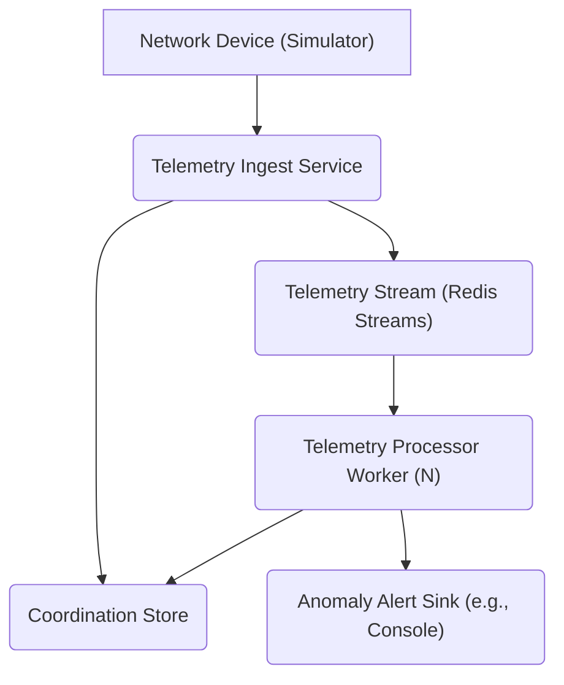

### 1. Moderate: Distributed Network Telemetry Processing & Anomaly Detection

**Time Estimate:** 3-5 hours

**Tech Stack (Suggestions):** Python 3.10+, FastAPI, Redis Streams, Docker Compose

---

## Welcome

Thank you for your interest in joining our team! This take-home assignment is designed to give you an opportunity to demonstrate your skills in building distributed systems with Python, particularly in a network-centric context.

**Important:** You are encouraged to use AI assistants (ChatGPT, Claude, GitHub Copilot, etc.) throughout this assignment. We want to see how effectively you can leverage these tools. You must document your AI usage as described in the [AI Usage Requirements](#ai-usage-requirements) section.

---

## The Challenge

Build a **distributed system for processing network telemetry data** in real-time, performing basic aggregation, and detecting simple anomalies. This simulates a common challenge in managing large-scale network infrastructures where device performance and health data needs continuous monitoring.

### System Architecture



---

## Requirements

### Core Requirements (Must Complete)

#### 1. Telemetry Ingest Service

Create an HTTP service that can receive network telemetry data and forward it to a stream processing system. The service should accept network metrics (device information, interface details, metric values, timestamps) and handle them asynchronously.

#### 2. Telemetry Processor Worker Service

Build a distributed worker system that processes telemetry events from the stream. The system should support multiple worker instances and include:

- **Stream Processing:** Workers should consume events from the telemetry stream with proper distribution and delivery guarantees
- **Aggregation:** Calculate aggregated metrics over time windows (consider tumbling windows for consistency)
- **Anomaly Detection:** Identify when metrics exceed normal operational thresholds
- **State Management:** Handle worker state and recovery scenarios
- **Output:** Provide visibility into processed results and detected anomalies

#### 3. Coordination & Storage

Design an appropriate coordination mechanism and choose storage systems that support the streaming and state requirements of your distributed workers.

---

### Extended Requirements (Complete at least 1)

Choose at least one additional capability to demonstrate deeper system understanding:

1.  **Dynamic Configuration:** Implement a mechanism for runtime configuration changes that affect worker behavior without requiring restarts.
2.  **Backpressure Management:** Design and implement a strategy to handle system overload scenarios gracefully.

---

### Bonus (If Time Permits)

These are entirely optional but will strengthen your submission:

-   Docker Compose setup to run all services, including multiple Telemetry Processor Worker instances.
-   A simple simulated network device that continuously sends telemetry data to the Ingest Service.
-   Unit tests for the stream processing logic and state management.

---

## Technical Guidelines

### Tech Stack Guidance

-   **Language:** Python 3.10+
-   **Suggested Technologies:** FastAPI, Redis Streams, Docker Compose
-   Consider async patterns where appropriate for I/O operations

### Project Organization

Structure your code in a way that separates concerns and makes the system easy to understand and run. Include proper documentation and dependency management.

---

## AI Usage Requirements

You **must** document your AI usage in a file called `AI_LOG.md`. This is a required part of your submission.

### Log Format

~~~markdown
# AI Interaction Log

## Interaction 1: [Brief Description]
**Tool:** [Claude/ChatGPT/Copilot/etc.]
**Purpose:** [What you were trying to accomplish]

### Prompt
```
[Your prompt]
```

### AI Response
[Summarize the key parts of the response. No need to copy everything.]

## Interaction 2: [Brief Description]
...
~~~

### Tips for AI Usage

-   **Do** use AI to scaffold boilerplate code, explain concepts, debug issues.
-   **Do** iterate on AI responses - ask follow-up questions.
-   **Do** modify AI-generated code to fit your needs.
-   **Do** understand code before using it.
-   **Don't** blindly copy-paste without review.
-   **Don't** use AI-generated code you can't explain.

---

## Deliverables

Your submission must include:

- **Source Code** - Entire source code of your submission
- **README.md** - Architecture decisions, trade-offs
- **AI_LOG.md** - Your AI interaction log

## Submission Instructions

Submit your work via GitHub Pull Request:

1. **Clone the repository**
   ```bash
   git clone REPO HERE
   cd take_home
   ```

2. **Create a branch with your name**
   ```bash
   git checkout -b submission/your-name
   ```
   Example: `git checkout -b submission/jane-doe`

3. **Complete the assignment and commit your changes**
   ```bash
   git add .
   git commit -m "Complete take-home assignment"
   ```

4. **Push your branch**
   ```bash
   git push origin submission/your-name
   ```

5. **Create a Pull Request**
   - Go to the repository on GitHub
   - Click "Compare & pull request" for your branch
   - Title: **Take-Home Submission: Your Name**
   - In the PR description, include:
     - Brief summary of your changes
     - Which extended requirement you implemented
     - Any notes or questions for reviewers

6. **Notify us**
   - Email Leslie at **lquisenb@cisco.com** with a link to your PR

---

## What We're Looking For

-   Clean, readable code.
-   Strong understanding of distributed stream processing concepts (consumer groups, stateful processing, windowing, fault tolerance, dynamic scaling) applied to network telemetry.
-   Robust handling of message delivery semantics and state recovery.
-   Clear documentation of design choices and trade-offs.
-   Effective use of AI tools.

We're not looking for perfection. We want to see how you think, how you make trade-offs, and how you communicate your decisions.

---

Good luck! We're excited to see your approach. 